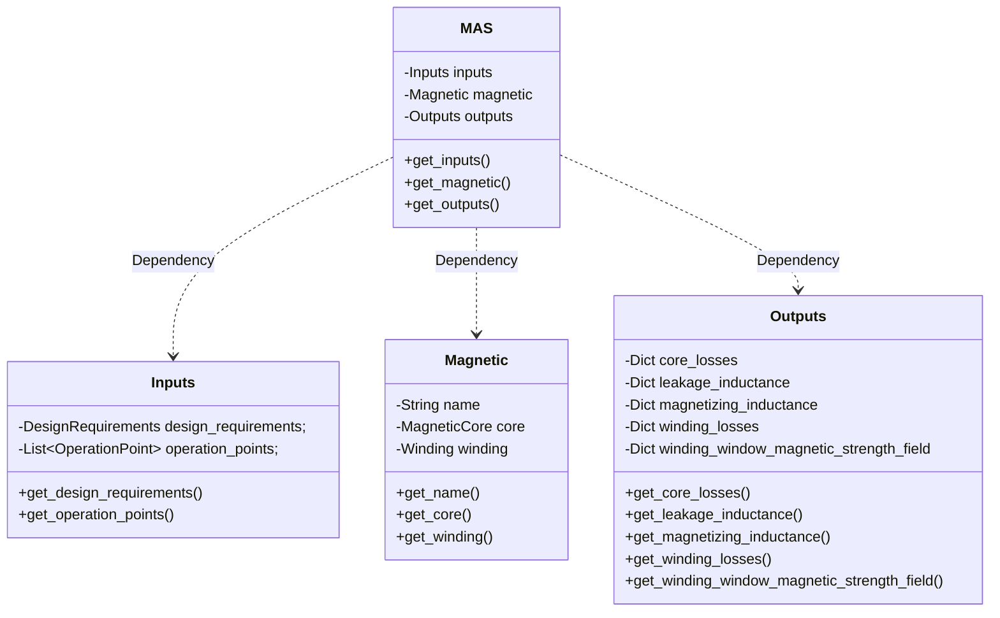

# Magnetic Agnostic Structure (MAS)

What I present here is the initial version of a common language that can **unambiguously describe a magnetic component**. The aim of this project is to provide a format that can be **written and understood by any human**, that can be **shared**, **copied**, **versioned**, and **stored** efficiently; that different software tools can read it and produce an equal result, be they Analytical tools, Circuit simulators, Finite Element or CAD software. A format can automatically produce a technical drawing, a 3D model, a temperature estimation, a magnetic field plot, or a list of assembly steps, without leaving a detail to interpretation.

This first prototype I called Magnetic Agnostic Structure, because it defines a magnetic independently of its kind or application, and because being an Engineer, I like puns, and its acronym is MAS, which means "more" or "plus" in my mother tongue, Spanish.

I would like to start with some clarifications, or "design decisions" , I took along the way, and explain why I took them. I also think they are a nice way of introducing the reasoning behind the MAS format.

A magnetic component is just a piece of iron with copper wires around it without an application. The excitation defines the magnetic as much as the construction: the same component can be used as a transformer in a LLC or as an inductor in a Flyback. Some coupled inductors can be used as a common mode choke. Of course, the performance is not going to be the same, as normally one component is optimized for an application, but that is beside my point. What I want to highlight is that the operation point (excitation and conditions) is as important as the construction, and they must be equally defined.

For that reason, I decided for my specification to cover both, but separate, and I called them inputs and magnetic. One input can excite many magnetics, and one magnetic can work with many different inputs.

Another design decision I took was to support indirection (also called dereferencing). This is a fancy term used mainly in programming, but the used is a logical one: when a property needs to be defined (let’s say the shape of the core) the property can be defined directly in the document (by including all the data about that shape: dimensions, family, etc.) or just a name (just say we are using shape ETD 49). Of course, in the second case, that reference needs to be defined somewhere accessible (in a manufacturer datasheet, in the standard, or in another database).It might be weird, but we will clarify it with further examples later. But why would I want to do that? Well, because it allows us to use components that already exist (RM 12, TDK N87, Litz 800x0.1) together with custom definitions (a custom shape, a custom wire, or a custom material). It even allows us to define and reuse our custom components.It allows us to create a scalable system.

The last decision I took was the format of the files. It needs to be a structured format that is readable and editable easily by a human, that can be processed by a generic software, that can be stored in a database, downloaded, or even printed; and ideally that could enforce certain templates, in order to maintain the format itself.

I decided to go with JSON (JavaScript Object Notation, pronounced /ˈdʒeɪsən/; also /ˈdʒeɪˌsɒn/) because it supports lists (used for listing the different windings in a magnetic) and dictionaries (a key-value part, for example: "shape": "ETD49"), it has no strange keywords around, so it is really easy to read, it is supported by any programming language and software, it can be efficiently stored in most modern databases; and my favorite part, it has a declarative language (called JSON Schema: https://json-schema.org) that defines the structure of a given JSON, so it is possible to establish that a JSON defining a core must have a material and a shape, or otherwise it is wrong.

So we already have some foundational steps: we are going to define inputs and magnetics, we can define custom parts, name them, and reuse them; and we can define rules to enforce our format. It sounds like a good start to me.

## Inputs
As explained in the [Inputs Section] (https://github.com/OpenMagnetics/MAS/blob/main/docs/inputs.md)

## Magnetic
As explained in the [Magnetic Section] (https://github.com/OpenMagnetics/MAS/blob/main/docs/magnetic.md)

## Outputs
As explained in the [Outputs Section] (https://github.com/OpenMagnetics/MAS/blob/main/docs/outputs.md)

