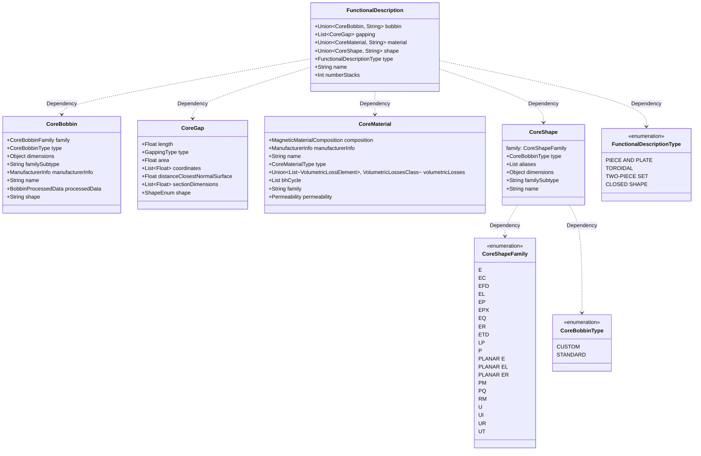

Magnetic Agnostic Structure (MAS) is a project providing a common language for defining any kind of magnetic for Power Electronics, independently of its function (transformer, inductor, choke, etc.), construction (number of winding, planar or wound technology, materials used, etc.), application (power conversiob, filtering, etc.) , or manufacturer.
This is accomplished with a series of JSON schemas that provide rules for defining any magnetic.

The structure follows a modular structure, and the information is broken down in the follwing sections:
* Operation Point (IN PROGRESS)
* Operation Conditions (TBD)
* Core
* Winding (IN PROGRESS)

# Core

Complex structures, like the core, can be described in with many levels of detail, and each of these levels can be used for different purposes. 
For eexample, a simple level, containing the dimensions of the core, and the length a gap, can be used in a simple reluctance model; while a complex model like Finite Elements would need a detailed descripcion of all the pieces involved.
To this end, a "complexity level" approach has been followed, producing three different alternative levels of detail of the core: functional, geometrical, and processed level.
* Functional level: It covers the bare minimum to describe the core, but lacks enough processed information to be used in most calculations. Nevertheless, the rest of levels can be derived from this one. Additionally, the information at this level is what must be stored in a DB.
* Processed level: It contains processed information, derived from the functional level, that can be used in simple analytical models.
* Geometrical level: It contains the detailed information of how the core is made, including the different parts, and their relative position.

