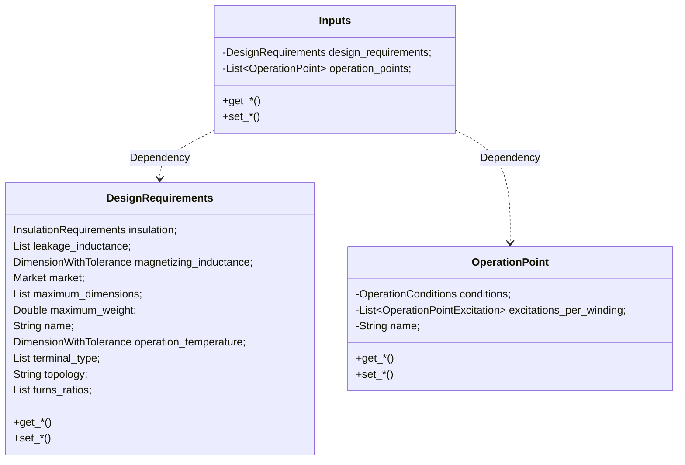
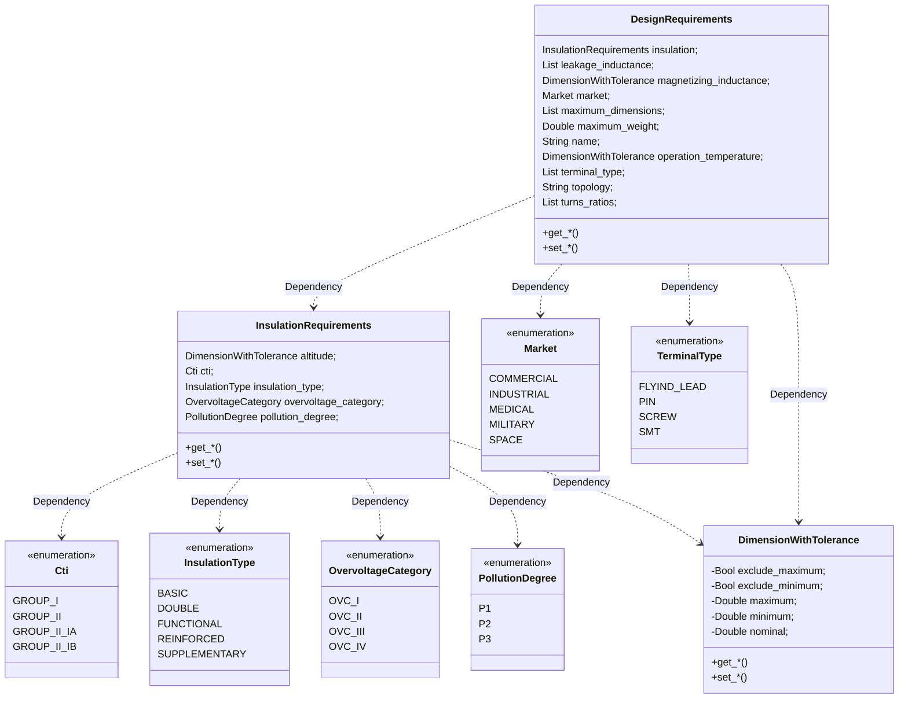
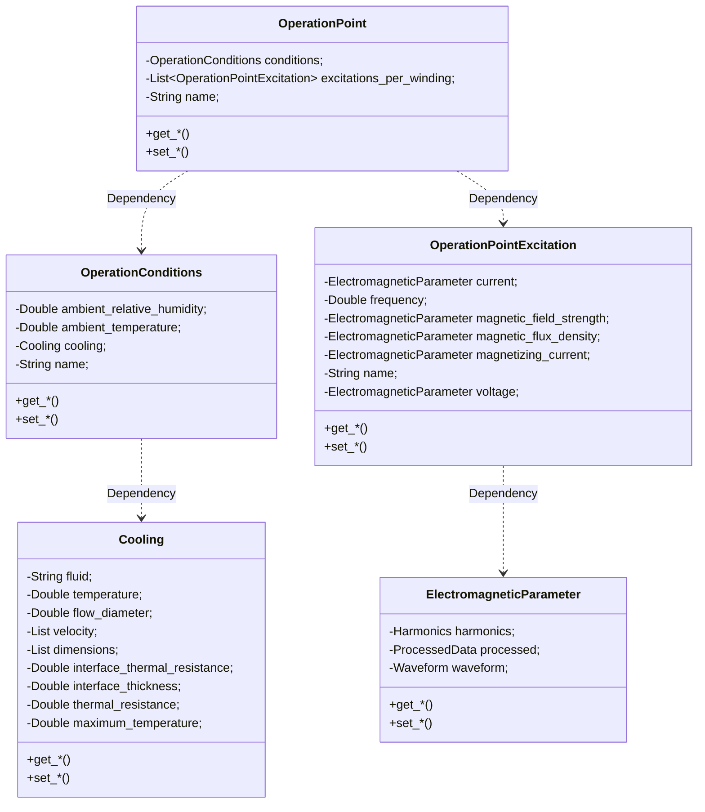
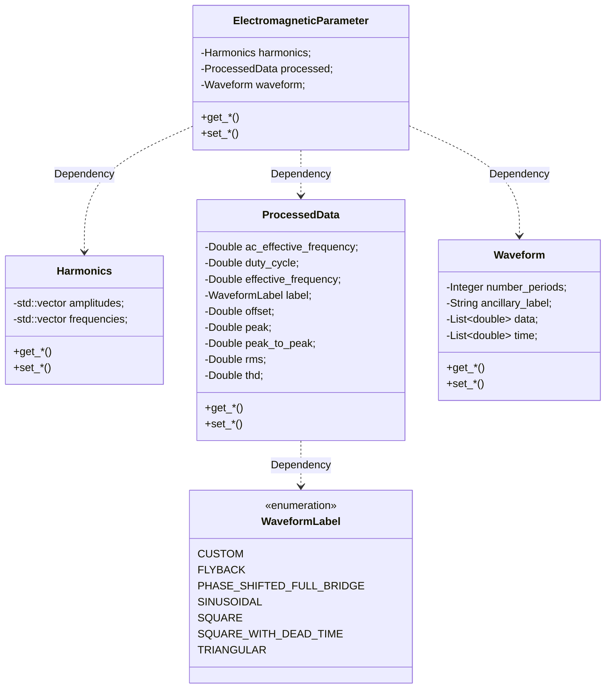

# Inputs
We have finished describing the magnetic core, but as we commented at the beginning, a magnetic core without its inputs cannot really be defined, as we cannot even establish if it will work. Only by describing the requirements of the application, and the excitations to the Electronics system, can a magnetic component be correct.

The specification of the inputs is therefore divided into two parts, a list of design requirements for the magnetic to comply with, and a list of operation points, which the magnetic has to be optimized for.





Additionally, as it happens in reality, one design requirement can spawn many magnetic components, or a magnetic component can comply with several design requirements. 
## Name
This name references the inputs and can be used to refer to it from any number of magnetic components or simulations. This field can contain any valid string of characters.
## Design Requirements
The design requirements represent the constraints that the designer (human or software) of the magnetic has to comply with in order to create a proper device. 

As many of the requirements don’t usually have a fixed value, providing instead a tolerance or a minimum or maximum value, all field marked as numeric requirements must be specified with the following fields, of which at least one of the numeric one is compulsory:

* Nominal: Nominal numerical value for the requirement
* Minimum: Minimum numerical value for the requirement.
* Exclude Minimum: Boolean value that indicates if the minimum value is included or not.
* Maximum: Maximum numerical value for the requirement.
* Exclude Maximum: Boolean value that indicates if the maximum value is included or not.

This object must have the following fields:

* Name: Reference name of the design requirements.
* Magnetizing Inductance: Numeric requirement representing the inductance that the magnetic must have in order to work.
* Turns ratios: List of numeric requirements, where each element represents the turns ratio that a secondary winding must have referred to the primary. An empty list represents a component with only the primary (a basic inductor)
* Leakage inductance (optional): List of numeric requirements, where each element represents the leakage inductance that a secondary winding must have referred to the primary.
* Operation Temperature (optional): Numeric requirement representing the temperature that the magnetic can reach under operation.
* Insulation requirements (optional): Field needed to calculate the insulation requirements.
    * Altitude (optional): Numeric requirement representing the altitude at which the magnetic will work, in order to calculate insulation requirements.
    * CTI (optional): Required CTI the magnetic must comply with. It can be one of the following:
        * Group I
        * Group II
        * Group IIIa
        * Group IIIb
    * Insulation Type (optional): Required type of insulation. It can be one of the following:
        * Functional
        * Basic
        * Supplementary
        * Double
        * Reinforced
    * Overvoltage Category (optional): Required overvoltage category. It can be one of the following:
        * OVC-I
        * OVC-II
        * OVC-III
        * OVC-IV
    * Pollution Degree (optional): Required pollution for the magnetic to work under. It can be one of the following:
        * P1
        * P2
        * P3
* Market (optional): Market where the magnetic will end up being used. It can be one of the following:
    *Medical
    *Commercial
    *Industrial
    *Military
    *Space
* Maximum Dimension (optional)s: Maximum dimensions, width, height, and depth, for the designed magnetic, in m.
* Maximum Weight (optional): Maximum weight for the designed magnetic, in Kg.
* Terminal Type (optional): Type of the terminal that must be used, per winding. It can be one of the following:
    *Pin
    *Screw
    *SMT
    *Flyind Lead
* Topology: Topology that will use the magnetic.




## Operation Points
The other part of a magnetic specification is the operation points that it must work under or be optimized for.
Although a magnetic is normally designed for a given topology, what really matters from the electromagnetic point of view (apart from the Design Requirement defined previously) is the excitation that it has in each of its ports, the energy that excites the magnetic component. And also is not really practical to define all variables for each topology and each of its possible configurations and controls.

Due to all these the operation points were defined from the point of view of the magnetic, as topology-agnostic waveforms, collection of points that define a signal.

And because a magnetic working on a converter must function and be efficient over a range of operation conditions, it must be designed taking into account different excitations and conditions, so it can be optimal for common cases and still work in extreme cases.

To take this into account, the operation points are designed as a list, where each element contains two main fields: the operation conditions and excitations of each winding.



### Name
This name references the Operation Point and can be used to refer to it from any number of magnetic components or simulations. This field can contain any valid string of characters.
### Operation Conditions
Before defining the excitations it is necessary to define the ambient conditions that will exist at that point. The reason these variables are defined here and not in the previous section of Design Requirements is to give the opportunity to design the magnetic for different excitations and different temperature and humidities and see how it behaves, instead of a global maximum value.

* Ambient temperature: Ambient temperature for this operation point.
* Relative humidity (optional): Relative humidity for this operation point.
* Cooling: Dictionary/Map that represents the cooling condition applied to the magnetic. It can be one of the following options:
    * Natural Convection Cooling: Data describing a natural convection cooling.
        * Temperature: Temperature of the fluid. To be used only if different from ambient temperature.
        * Fluid: Name of the fluid used, default: air.
    * Forced Convection Cooling: Data describing a forced convection cooling.
        * Velocity: Three-dimensional vector describing the velocity of the fluid.
        * Flow Diameter: Diameter of the fluid flow, normally defined as a fan diameter.
        * Temperature: Temperature of the fluid. To be used only if different from ambient temperature.
        * Fluid: Name of the fluid used.
    * Heatsink Cooling: Data describing a heatsink cooling.
        * Thermal Resistance: Bulk thermal resistance of the heat sink, in W/K.
        * Interface Thermal Resistance: Bulk thermal resistance of the thermal interface used to connect the device to the heatsink, in W/mK.
        * Interface Thickness: Thickness of the thermal interface used to connect the device to the heatsink, in m.
        * Dimensions: Dimensions of the cube defining the heatsink.
    * Cold Plate Cooling: Data describing a cold plate cooling.
        * Thermal Resistance: Bulk thermal resistance of the cold plate, in W/K.
        * Maximum Temperature: Maximum temperature of the cold plate.
        * Interface Thermal Resistance: Bulk thermal resistance of the thermal interface used to connect the device to the cold plate, in W/mK.
        * Interface Thickness: Thickness of the thermal interface used to connect the device to the cold plate, in m.
        * Dimensions: Dimensions of the cube defining the cold plate.

### Excitation per winding
This section describes the most important part of all the inputs, the waveforms that the magnetic will see, and be excited by, at each of its inputs and outputs. 
In order to have a structure that supports any number and combinations of individual windings, the excitations are defined in a list, with a number of elements equal to the number of elements in the Design Requirement field of Turns Ratios plus one, or what is equivalent, the number of windings.

It is possible that excitations for some or all secondaries are missing from specification, in which case they can be calculated by reflecting the waveform from the primary with the turns ratio of each secondary.

Each of these elements are composed of a frequency and one or more Electromagnetic Parameters (e.g.: current, voltage), and before looking at all the possible fields, I would like to define what an Electromagnetic Parameter is in this context.
#### Electromagnetic Parameters
This type is a template for any kind of signal existing in a magnetic, and as it happens with the important variables of the magnetic core, they are defined at three levels of definition, all of them derivable from any of them, which means that any level can completely define the signal.

The first level of definition is the direct waveform, and contains the following fields:
* Data: List of numeric values that define the signal. If the list comes without an associated time field, these values must be considered equidistant and evenly spread over the period.
* Time (optional): List of numeric values that define the time of each of the data points inside the period.

The second level of definition is the processed data about the waveform, from which the waveform itself can be built back. Additionally, they are designed to quickly provide for the values necessary in most analytical models. It contains the following fields:
* Label: Label of the waveform, if applicable. Used for common waveforms. If custom, the proper waveform must be defined. It can be one of the following:
    * Custom 
    * Triangular 
    * Square 
    * Sinusoidal 
    * Rectangular
    * Flyback 
    * Phase-shifted full bridge
* Duty Cycle: The duty cycle of the waveform, if applicable.
* Peak To Peak: The peak to peak value of the waveform.
* Peak: The maximum positive value of the waveform.
* Offset: The offset value of the waveform, referred to 0.
* RMS: The Root Mean Square value of the waveform.
* Effective Frequency: The effective frequency value of the waveform, according to https://ieeexplore.ieee.org/document/750181, Appendix C
* AC Effective Frequency: The effective frequency value of the AC component of the waveform.
* THD: The Total Harmonic Distortion of the waveform, according to https://en.wikipedia.org/wiki/Total_harmonic_distortion

The third and last level of definition is the harmonics data, which is a list of the most powerful harmonics in the signal, created by applying the Discrete Fourier Transform to the signal, and which can be reversed in order to create back the original signal, although with loss of information, as the list of harmonics is not infinite. It has the following fields:
* Amplitudes: List of amplitudes of the harmonics that compose the waveform.
* Frequencies: List of frequencies of the harmonics that compose the waveform.





#### Excitation
Now that we have defined what we are calling Electromagnetic Parameter, let’s use that definition to finally describe the structure of the excitation per winding, which contains the following fields (pun intended):

Frequency: Frequency of the waveform, common for all electromagnetic parameters
Current: Electromagnetic Parameter representing the current through the wires of the winding.
Voltage: Electromagnetic Parameter representing the voltage that falls at the winding.
Magnetizing Current: Electromagnetic Parameter representing the part of the current used in magnetizing the magnetic core and generating the magnetic field. For inductors with one winding it is equal to the current field.
Magnetic Flux Density: Electromagnetic Parameter representing the magnetic flux density circulating through the magnetic core, induced by the magnetizing current.
Magnetic Field Strength: Electromagnetic Parameter representing the magnetic field strength circulating through the magnetic core, induced by the magnetizing current.

Wrapping up the inputs
As happened with the magnetic, the MAS format for the inputs can include quite a lot of information, but it is designed so all that information can be calculated from a small specification file, perfectly understandable by humans and software.

Example inputs for an inductor:
```
{
    "name": "My Inputs",
    "designRequirements": {
        "magnetizingInductance": {"nominal": 0.000465},
        "turnsRatios": []
    },
    "operationPoints": [
        {
            "conditions": {
                "ambientTemperature": 25.0,
                "cooling": {
                    "fluid": "air",
                    "velocity": [0, 0, 0]
                }
            },
            "excitationsPerWinding": [
                {
                    "frequency": 100000.0,
                    "current": {
                        "waveform": {
                            "data": [41.0, 51.0, 41.0],
                            "time": [0.0, 2.5e-06, 1e-05]
                        }
                    },
                    "voltage": {
                        "waveform": {
                            "data": [7.5, 7.5, -2.5, -2.5, 7.5],
                            "time": [0.0, 2.5e-06, 2.5e-06, 1e-05, 1e-05]
                        }
                    }
                }
            ]
        }
    ]
}
```

