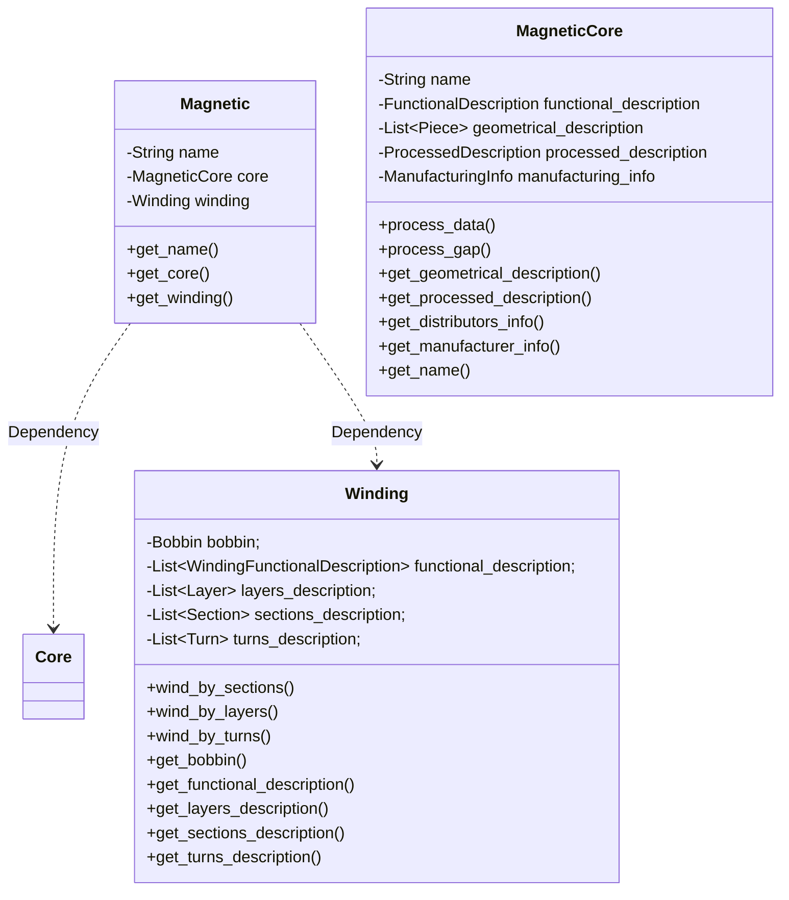

# Magnetic
I am going to separate into different specifications (and therefore files or entries in the database) anything that has to do with input to the system (operation points and requirements) from the physical system itself (the magnetic component). This first chapter describes how a magnetic can be described.

It is a common practice of magnetics manufacturers to decouple cores (including gaps) and windings, having collections of compatible cores and wound bobbins, which allows having a multitude of different magnetics by combining them.

I have followed the same principle for separating the different parts of the magnetic component, choosing to define the core and winding as two (almost) independent objects. Cores and windings can be defined by themselves and linked together, supporting even having magnetic cores with more than one winding window, and placing different windings in each one.

## Name
This name references the magnetic component and can be used to refer to it. This field can contain any valid string of characters, and can hold the manufacturer's reference or a description of a custom magnetic.

## Core
As defined in the [Core Section] (https://github.com/OpenMagnetics/MAS/blob/main/docs/magnetic/core.md)

## Winding
As defined in the [Winding Section] (https://github.com/OpenMagnetics/MAS/blob/main/docs/magnetic/winding.md)

