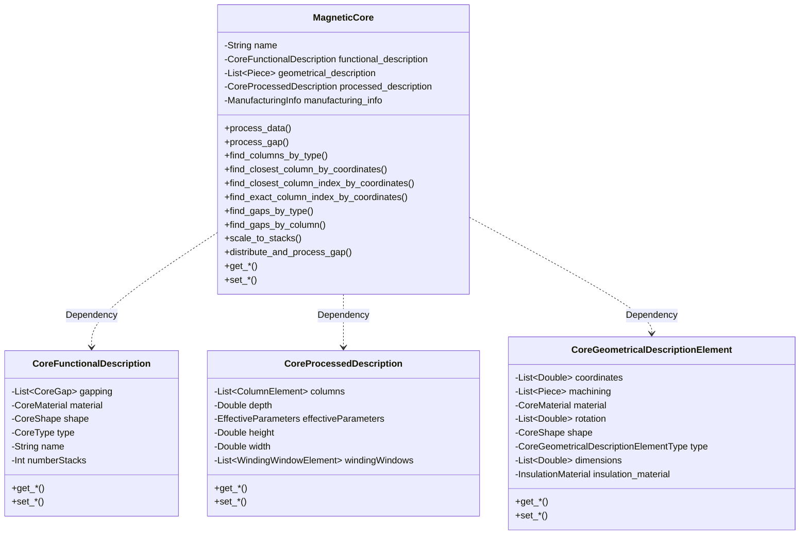
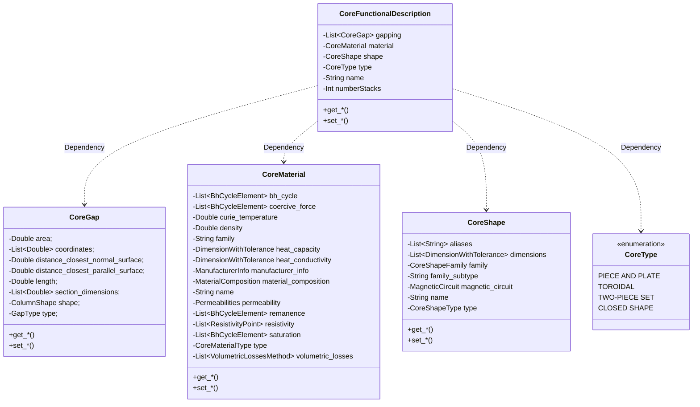
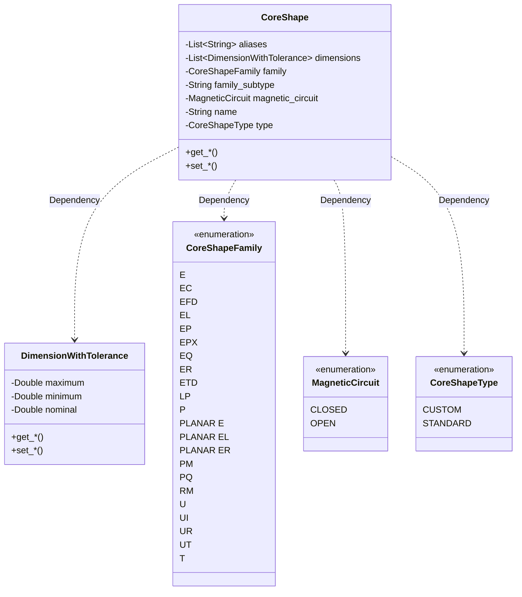
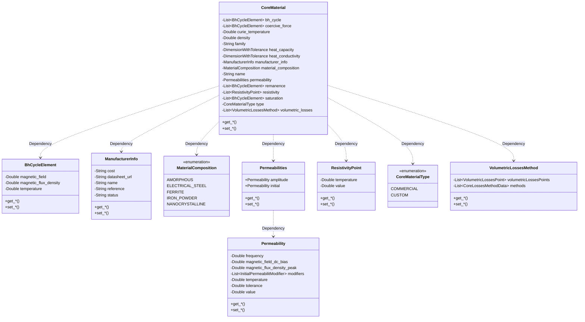
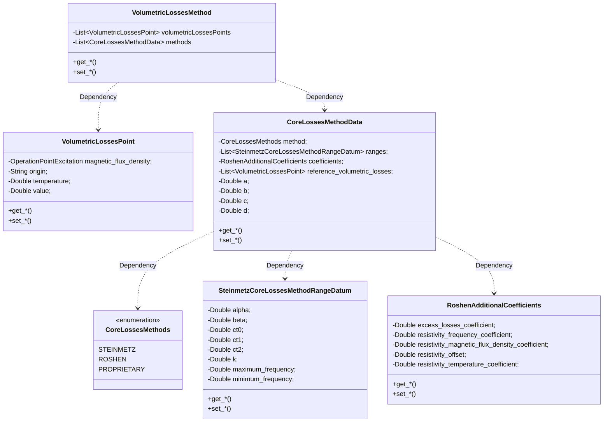
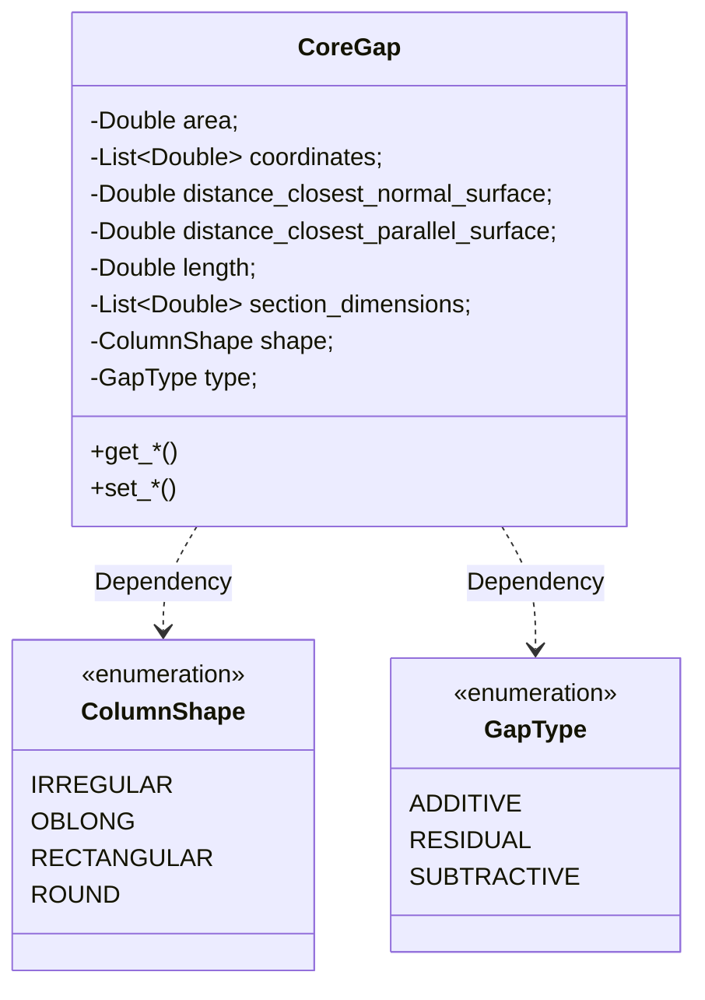
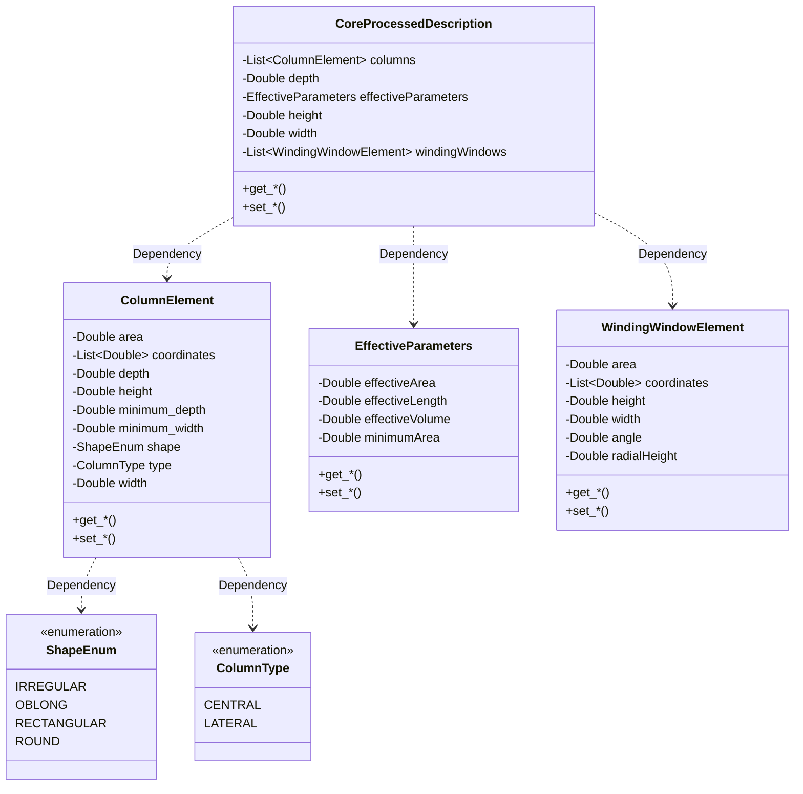
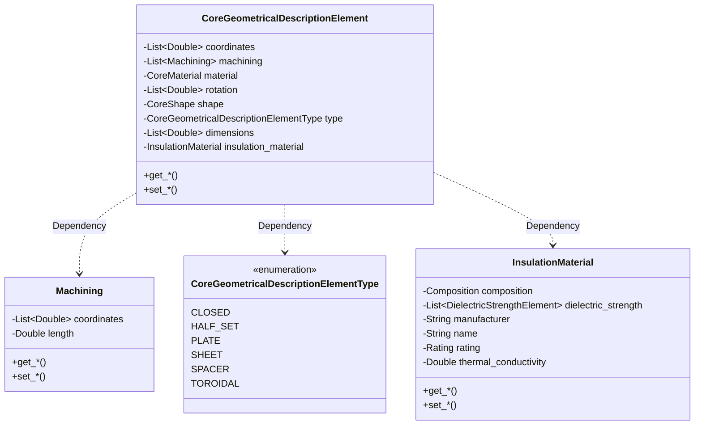

# Core
This section must completely define the magnetic core used in our magnetic component. It must support Commercial off-the-shelf (COTS) core as well as customized ones. With the information in this section any user or software must be able to identify and buy the core from a distributor, create a 3D model for simulation, or be able to manufacture it.

In order to achieve this, the information is grouped in three levels or descriptions, each one independent from the others. Ideally any level / description must be able to describe the core, and all the information of the core can be extracted from any of them. This descriptions are:
* **Functional description**: The most commonly used in core datasheets, here is the information that describes the core from the functional point of view: shape, material, number of stacks, etc. Practical for humans.
* **Processed description**: Here the processed information is kept. Things like the dimensions of the columns, the winding windows, or the effective parameters of the shape are stored here. Practical for analytical models.
* **Geometrical description**: This is the information of the core related to its geometry and relative position. Data about which pieces make the core, including ferrite pieces, spacers, or column chunks for distributed gaps, along to all their relative positions , rotations, and machining. Practical for CAD models.




More information about each one will be provided in each section.
## Name
This name references the core and can be used to refer to it from any number of magnetic components. This field can contain any valid string of characters, and can hold the manufacturer's reference or a description of a custom core.
## Manufacturer Info
Optional field for COTS cores, compiling the information about the manufacturer and possible distributors.
* Reference: Reference name given by the manufacturer.
* Relative Cost (optional): Relative cost compared with other cores.
* Distributors: List of elements, where each elements represents one distributor (including the manufacturer itself, if they also provide direct sales) and offer, containing the following fields:
    * Reference: Reference given by the distributor
    * URL (optional): If sold online, the URL to the product
    * Cost: Absolute cost of the core in dollars by the distributor
## Functional Description
This level describes the core in a way mainly thought for humans, defining the core with the values used by most Power Engineers. 
I decided to break down the specification in part following the common use in the industry. A core manufacturer has a list of materials they use to create their cores (ferrites, iron powder, nanocrystalline, etc.) and then uses those materials to create a core with a given shape (RM8, PQ40/40, T25), and then it might machine some gapping into some column. Additionally, some of these shapes can be stacked to create larger cores.




### Shape
This field has two possible definitions, a text reference to which shape is used, or the proper definition of the shape, according to the dimensions described in DIN EN 62317. It must be clarified that in the case of pieces designed to go in sets, like most non-toroidal cores, the specification described here is for just one piece, not the whole set.

It was mentioned before, but in the first case, just the name of the shape, the information must be stored somewhere accessible. A common setup that complies with this condition is having a database with all the shapes defined by the standard.

Basically this allows us to create a collection of shapes in only one place and just use references to these shapes in our designs, so any human or software can easily look up any data regarding that shape by only knowing its name.

The fields needed to describe a shape are:

* Name: Name of the shape, (e.g.: ETD 49/25/16)
* Aliases: Other names this shape can have (e.g.: ETD 49)
* Type: Indicates if the shape is standard or custom.
* Family: family of the shape, as written in the aforementioned standard (RM, PQ, etc.)
* Magnetic Circuit: indicates if the magnetic is core (as it is the case for toroids or UT cores) or open (PQ, RM, U, etc.). Open magnetic circuit shapes are usually used in sets of two to make a close circuit.
* Family Subtype: When several forms are possible for a shape, this field represents the index of that subtype (e.g.: PM has two subtypes: 1 and 2)
* Dimensions: Dictionary/Map holding the different dimensions of the shape, according to DIN EN 62317. It can contain different values due to tolerances, with variables for minimum, nominal and maximum dimensions.




The following is an example for RM 12/17:

```
{
    "name": "RM 12/17",
    "aliases": ["RM 12LP"],
    "type": "standard",
    "family": "rm",
    "magneticCircuit": "open",
    "familySubtype": "3",
    "dimensions": {
        "A": {"minimum": 0.03610, "maximum": 0.03740},
        "B": {"minimum": 0.00830, "maximum": 0.00840},
        "C": {"minimum": 0.01560, "maximum": 0.01610},
        "D": {"minimum": 0.00450, "maximum": 0.00475},
        "E": {"minimum": 0.02500, "maximum": 0.02600},
        "F": {"minimum": 0.01230, "maximum": 0.01280},
        "G": {"minimum": 0.01290},
        "H": {"minimum": 0.00540, "maximum": 0.00560},
        "J": {"minimum": 0.02870, "maximum": 0.02980},
        "R": {"maximum": 0.00030}
    }
}
```

The whole JSON Schema with the complete definition can be found in: https://github.com/OpenMagnetics/MAS/blob/main/schemas/magnetic/core/shape.json

All data for (up to my knowledge) all standard shapes (except toroids, but they are planned for later this year) can be found here: https://github.com/OpenMagnetics/MAS/blob/main/data/shapes.ndjson
### Number of Stacks
Integer number defining how many cores are stacked along the z axis (C dimension according to DIN EN 62317)
### Material
As the shape field, the material field can hold either a text reference to which material is used, or the actual definition of the material.
For the case of the definition, the following field are defined, although, in contrast with the previous field, many are optional or support different types of data. This design might look unnecessarily complex, but it was the way of having one structure for all the different materials used in Power Magnetics, along with the different methods used by different manufacturers. More information will be provided in each individual parameter:

* Name: Name of the material, as defined by the manufacturer (e.g.: 3C94)
* Family: Family to which the material belongs, as defined by the manufacturer (e.g. 3C, High Flux)
* Manufacturer Info: Dictionary/Map with the information about the manufacturer, including name, status of the material, internal reference, or cost.
* Type: Indicates if the shape is commercial or custom
* Curie Temperature: The temperature at which the material loses its ferromagnetism.
* Material Composition: Type of the material, can be one of the following: 
    * Ferrite
    * Iron Powder
    * Nanocrystalline
    * Amorphous
    * Electrical Steel
* Saturation: List of points defining the saturation at different temperatures. Each point must have its magnetic flux density, magnetic field strength, and temperature values.
* Permeability: Dictionary/Map containing all the different possible permeabilities, of which the only mandatory is the Initial Permeability. Each permeability can be defined in two ways, either with a list of points or with an individual point. Each point is defined by a value as a minimum, but can carry more data, including temperature, magnetic field DC bias, frequency (which is commonly used for ferrites), or even modifier equations (as it is common for Iron Powder materials). With this definition we can cover all from individual values, to temperature graphs, or equations. 
* VolumetricLosses: This is a list of possible methods for calculating the volumetric losses of the material. The options are:
    * Steinmetz coefficients: List of ranges defined by a minimum and maximum frequency, including the coefficients k, alpha and beta (and optionally ct0, ct1, and ct2, for temperature dependance) for calculating the volumetric losses for any method derived from Steinmetz.
    * Roshen coefficients: Values for calculating the volumetric losses according to Roshen’s method. The needed values are normally provided by the manufacturer: remanence, coercive force, resistivity, at optionally some reference volumetric losses.
    * List of measured volumetric losses points, each defining the excitation B field, its temperature, its measured value and the measuring method. It can be used for different statistical methods, from simple interpolation to Artificial Intelligence training.
* BH Cycle (optional): List of points defining the BH cycle. Each point must have its magnetic flux density, magnetic field strength, and temperature values.



Taking a deeper look into the core volumetric losses method:



The following example is for Ferroxcube 3C94:

```
{
    "type": "commercial", 
    "curieTemperature": 220,
    "materialComposition": "ferrite",
    "name": "3C94",
    "family": "3C",
    "manufacturerInfo": {"name": "Ferroxcube"},
    "permeability": {"initial": [{"value": 1438.0, "temperature": -40.0, "frequency": 10000.0}, {"value": 1523.0, "temperature": -30.0, "frequency": 10000.0}, {"value": 1650.0, "temperature": -20.0, "frequency": 10000.0}, {"value": 1776.0, "temperature": -10.0, "frequency": 10000.0}, {"value": 1914.0, "temperature": 0.0, "frequency": 10000.0}, {"value": 2078.0, "temperature": 10.0, "frequency": 10000.0}, {"value": 2250.0, "temperature": 20.0, "frequency": 10000.0}, {"value": 2474.0, "temperature": 30.0, "frequency": 10000.0}, {"value": 2696.0, "temperature": 40.0, "frequency": 10000.0}, {"value": 2926.0, "temperature": 50.0, "frequency": 10000.0}, {"value": 3171.0, "temperature": 60.0, "frequency": 10000.0}, {"value": 3423.0, "temperature": 70.0, "frequency": 10000.0}, {"value": 3613.0, "temperature": 80.0, "frequency": 10000.0}, {"value": 3786.0, "temperature": 90.0, "frequency": 10000.0}, {"value": 3924.0, "temperature": 100.0, "frequency": 10000.0}, {"value": 4039.0, "temperature": 110.0, "frequency": 10000.0}, {"value": 4005.0, "temperature": 120.0, "frequency": 10000.0}, {"value": 3952.0, "temperature": 130.0, "frequency": 10000.0}, {"value": 3912.0, "temperature": 140.0, "frequency": 10000.0}, {"value": 3773.0, "temperature": 150.0, "frequency": 10000.0}, {"value": 3795.0, "temperature": 160.0, "frequency": 10000.0}, {"value": 3850.0, "temperature": 170.0, "frequency": 10000.0}, {"value": 3934.0, "temperature": 180.0, "frequency": 10000.0}]},
    "saturation": [{"magneticFluxDensity": 0.34167244027867405, "magneticField": 73, "temperature": 100.0}, {"magneticFluxDensity": 0.38505343517127105, "magneticField": 80, "temperature": 25.0}],
    "volumetricLosses": {
        "default": [
            {
                "method": "roshen",
                "remanence": [{"magneticFluxDensity": 0.07894755435464, "magneticField": 0, "temperature": 100.0}, {"magneticFluxDensity": 0.162273628313529, "magneticField": 0, "temperature": 25.0}],
                "coerciveForce": [{"magneticFluxDensity": 0, "magneticField": 10.078443393042846, "temperature": 100.0}, {"magneticFluxDensity": 0, "magneticField": 15.964913844705038, "temperature": 25.0}],
                "resistivity": [{"value": 10, "temperature": -20}, {"value": 7, "temperature": 0}, {"value": 4, "temperature": 20}, {"value": 2, "temperature": 50}, {"value": 1, "temperature": 100}]
            }, 
            {
                "method": "steinmetz",
                "ranges": [
                    {"alpha": 1.419999968, "beta": 2.884999936, "ct0": 1.972776047, "ct1": 0.022263625000000002, "ct2": 0.00012535900000000002, "minimumFrequency": 1, "maximumFrequency": 150000, "k": 3.530102481},
                    {"alpha": 2.124999953, "beta": 2.70499994, "ct0": 2.1613195, "ct1": 0.023272995, "ct2": 0.00011659800000000001, "minimumFrequency": 150000, "maximumFrequency": 400000, "k": 0.000588}
                    ]
            }
        ]
    }
}
```


The whole JSON Schema with the complete definition can be found in: https://github.com/OpenMagnetics/MAS/blob/main/schemas/magnetic/core/material.json

All data for the most commonly used (and growing) materials can be found here:
https://github.com/OpenMagnetics/MAS/blob/main/data/materials.ndjson

### Gapping
This section defines a list with all the different gaps that can exist in a magnetic core. In order to simplify the use of the common cases, while allowing complex ones, each of the gaps in the list can be define with as little information as its length (and a centered standard subtractive gap will be assume), while allowing many other fields to be included, which would modify its type, or its vertical or horizontal placement. Additionally, some processed information can be included in order to completely define the behavior of the gap, especially its fringing effect.

* Length: Length of the gap along the path of the magnetic flux
* Type: Type of the gap, especially used in how the 3D models and drawings are created. It can be:
    * Residual: the residual gap existing between two imperfect parallel surfaces.
    * Additive: a gap created by adding an object between the pieces of the core, usually known as spacer.
    * Subtractive: a gap that is created by removing or grinding away part of the material of the core. Most common gaps are of this type.
* Coordinates: Vector of 3 with the X, Y and Z dimensions of the center of the gap, referred to the center of the winding column.
* Shape: Shape of the column where the gap is. It can be one of the following:
    * Oblong
    * Round
    * Rectangular
    * Irregular
* Distance Closest Normal Surface: Distance to the closest normal distance, usually the top or bottom part of the winding window.
* Distance Closest Parallel Surface: Distance to the closest normal distance, usually the opposite side of the winding window.
* Area: Geometrical area of the gap.
* Section dimensions: Dimension of the section of the column that is normal to the flux, where the gap starts or ends.

The number of elements in the list of gaps can be less, equal, or greater than the number of columns. If no coordinates are provided, the gaps can implicitly define some common cases:
* Empty list: Residual gaps in columns.
* One element: One grinded subtractive gap in the winding column (central column for most shapes)
* As may elements as columns, all with equal length: A spacer additive gap in all columns
* More gaps than columns: Distributed gaps in the central column.




Example of simple gapping, one grinded gap in the center, residual in the lateral legs

```
"gapping": [
    {
        "type": "additive",
        "length": 0.001
    },
    {
        "type": "residual",
        "length": 0.00001
    },
    {
        "type": "residual",
        "length": 0.00001
    }
]
```

The whole JSON Schema with the complete definition can be found in: https://github.com/OpenMagnetics/MAS/blob/main/schemas/magnetic/core/gap.json

## Processed Description
This level or description holds the processed data from the core. This is detailed data that is useful for working with the core, but it does not define its shape, instead it is a consequence of the shape.
The opposite step, from processed to functional, is done when selecting a magnetic core depending on the input excitations (for example, the Area Product or Energy methods). We implicitly define the winding window and the central column, and from that date we choose the shape that is closer to them.


### Dimensions
The width (x axis or A dimension according to DIN EN 62317), the height (y axis or B dimension according to DIN EN 62317), and the depth of the core (z axis or C dimension according to DIN EN 62317)
### Columns
* List of elements, where each one represents one of the columns of the magnetic core, and has the following variables:
* Type: Central or Lateral
* Shape: Shape of the column. It can be one of the following:
    * Oblong
    * Round
    * Rectangular
    * Irregular
* Area: Area of the section column, normal to the magnetic flux direction
* Width, Depth, Height: The dimensions of the column.
* Minimum width, Minimum depth: The minimum dimensions of the column, in the case of irrefular type.
* Coordinates: Vector of 3 with the X, Y and Z dimensions of the center of the gap, referred to the center of the winding column.
### Winding Windows
* List of elements, where each one represents one of the winding windows of the magnetic core. In most cases there will be only one, although the structure is thought to support any possible combination of cores with multiple winding windows. Each element has the following variables:
* Type: It can be either:
    * Rectangular, for concentric cores
    * Radial, for toroids
* Width/Angle: Horizontal width of the winding window (x axis or A dimension according to DIN EN 62317). Angle in radians in the case of toroids
* Height/Radial Height: Vertical height of the winding window (y axis or B dimension according to DIN EN 62317). In the case of toroids, the radial height from the surface of the toroid towards its center.
* Area: Area of the winding window.
* Coordinates: The coordinates of the center of the winding window, referred to the center of the main column. In the case of half-sets, the center will be in the top point, where it would join another half-set.
### Effective parameters
The field contains the effective parameters as defined in DIN IEC 60205. They are:
* Effective Length: Equivalent length that the magnetic flux travels through the core.
* Effective Area: Equivalent section that the magnetic flux traverses, because the shape of the core is not uniform and its section changes along the path.
* Minimum Area: Minimum area seen by the magnetic flux along its path.
* Effective Volume: This is the product of the effective length by the effective area, and represents the equivalent volume that is magnetized by the field.




## Geometrical Description
This level or description holds all the information of the core from a geometrical point of view, ready to be processed by software that need a 2D/3D representation to work with the magnetic component, as is the case of Finite Element Simulation. 
All the parts of the magnetic core are described here, including its shape, position, rotation machinings, and material. In contrast with the functional description, the gaps are not explicitly defined here as entities, but implicitly with the separation between pieces and the machinings (e.g.: grinding) done.

Each of the parts must have the following fields:
* Type: Type of part, it can be one of following:
    * Half set: If it one piece of a core set, like most concentric cores (e.g.: one piece of an RM12)
    * Toroid: Toroidal piece
    * Plate: Similar to half-set, but only the plate part, without the columns. (e.g. I pieces to create EI sets)
    * Sheet: Thin sheet used in laminated cores.
    * Closed: One piece cores that are not toroidal, like UT cores.
    * Spacer: Rectangular piece, usually of insulating material, that is used to separate cores and create gaps in all legs.
    * Chunk: Piece of material without a predefined shape, commonly used to create distributed gaps.
* Material: Material of the part. It can be one of the materials defined before, or an insulation material, like teflon or plastic.
* Shape: Shape of the part. It can be one of the shapes defined before, or a basic shape like a rectangle or a cylinder.
* Coordinates: The coordinates of the piece.
* Rotation: The rotation of the piece
* Machining: List of machining that must be applied to the piece, including its length and coordinate.



