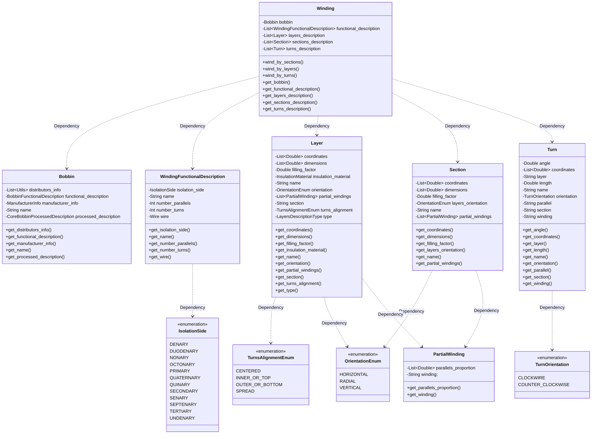

# Winding
Following the same principle as with the core, the winding is defined in an equivalent way as how they are manufactured: The wires are selected, prepared, and wound over a coil former following a series of steps. For this reason the bobbin or coil former is included in this section as part of the winding, which gives the possibility of defining a winding without a specific core, just its bobbin.
The nomenclature of the different elements of the winding used in this document tries to follow the most common practices in the industry, but in order to avoid misinterpretation they will be defined here:

* Winding: This can refer to the whole winding, when used at a magnetic level (e.g.: “The winding losses are overheating the magnetic”) or to an individual winding when specifically indicated (e.g.: “primary winding”, “winding 1”)
* Partial Winding: A subset of an individual winding, either a proportion of its turns or a proportion of its parallels; a proportion of both is not supported, and in those rare cases the Turns Description must be used. It contains the following fields:
	* Name: Reference name given to the partial winding.
	* Winding: Reference to the winding where it belongs to.
	* Turns proportion: Number from 0 to 1 indicating the proportion of turns contained in this partial winding.
	* Parallel proportion: Number from 0 to 1 indicating the proportion of parallels contained in this partial winding.
* Winding window: This is the space available for placing the turns of any or all windings in a magnetic component. There is usually one per core, but certain kinds of bobbins offer many windows in order to help control the coupling, in which case more than one winding window will be available.
* Physical turn: Any physical turns wound around the bobbin, independent of its series or parallel connection. Current can circulate through it, generating losses and magnetic field.
* Turn: A turn from the magnetic point of view, in the sense that it is connected in series with others and generates inductance.
* Parallel: A physical turn that is connected in parallel with others, and all of them are considered as one from the magnetic point of view. Electrically it divides the current through the magnetic turn they belong to.
* Layer: A group of physical turns that are wound together, one after the other, in a vertical (e.g.: wound inductors) or horizontal (e.g.: planar inductors) fashion. The increment and positioning can be done in one dimension.
* Section: A group of layers (or only one layer) that belong to the same winding (e.g.: primary winding) or a group of similar windings (e.g.: two secondaries wound together in a Center-tapped Full Bridge). The number of sections and their relative placement defines the interleaving of the whole winding.
* Isolation side: Label that defines one individual winding or a group of windings that have a common ground. Windings with different labels imply that they are electrically isolated.



Additionally, four levels or descriptions are used, each one more detailed than the previous one. The reason for this is to provide the freedom to choose the necessary level of detail needed for a given application. A core losses model might only use the basic Functional Description, with the number of turns; a leakage inductance model might use a Section Description to study the interleaving; a temperature model or a Finite Element simulation might use a Layer Description to predict the temperature rise; and finally winding losses model or a automatic tool for creating assembly instructions might use the Turn Description to accurately predict the losses or generate the assembly steps.
## Name
This name references the whole winding and can be used to refer to it from any number of magnetic components. This field can contain any valid string of characters.
## Bobbin
As it was explained before, the bobbin is optionally included in this section, the winding, instead of the core, as it is the part where the wires are wound, allowing combining different cores for the same winding. 
If this is not present, the winding is described only as a 2D entity, and can only be fully described once the core has been chosen.
This field can be of two types, either a string containing the reference of the bobbin used, or the description of the bobbin itself. In the second case it contains the following fields:

* Name: Reference name for this bobbin.
* Type: The type of a bobbin. It can be either:
	* Standard
	* Custom
* Family: Family of core shape that this bobbin is compatible with
* Manufacturer Info: Dictionary/Map with the information about the manufacturer, including name, status of the material, internal reference, or cost.
* Shape: The name of a magnetic shape that this bobbin belongs to
* Family Subtype: The subtype of the shape this bobbin belongs to, in case there are more than one.
* Dimensions: The dimensions of a bobbin, keys must be as defined in EN 62317

## Functional Description
This level or description is intended to hold the minimum information that can describe the winding of a magnetic component, although only in simple cases completely. It is intended for applications with simple windings or where detailed information is not needed, as is the case of an inductance or core losses model.
The structure consists of a list of elements, where each element describes one individual winding (e.g.: primary, secondary, auxiliary). A simple inductor will have one element, a simple transformer two, and any extra winding for additional outputs will be additional elements in the list.
Each of these windings will contain the following fields:
* Name: Reference name of the winding (e.g.: primary).
* Isolation Side: Reference label for the isolation side, as defined previously.
* Number Parallels: Number of parallels in this winding, as defined previously.
* Number Turns: Number of turns in this winding, as defined previously.
* Wire: Wire used in this winding. As defined in the [Wire Section] (https://github.com/OpenMagnetics/MAS/blob/main/docs/magnetic/wire.md)


Example of Winding Functional Description of an inductor:
```
{
    "name": "MyInductor",
    "functionalDescription":[
        {
            "name": "MyWinding",
            "numberTurns": 42,
            "numberParallels": 2,
            "isolationSide": "primary",
            "wire": "Litz 450x01"
        }
    ]
}
```


Example of Winding Functional Description of a transformer:
```
{
    "name": "MyTransformer",
    "functionalDescription":[
        {
            "name": "Primary",
            "numberTurns": 42,
            "numberParallels": 2,
            "isolationSide": "primary",
            "wire": "Litz 450x01"
        },
        {
            "name": "Secondary",
            "numberTurns": 23,
            "numberParallels": 1,
            "isolationSide": "secondary",
            "wire": "Solid Round 32AWG"
        }
    ]
}
```

## Sections Description
This level or description is an increment to the previous one, adding more detail to the Functional level. It describes the winding with a granularity of sections (as described above).

If we represented the winding window of the core as a 2D rectangle, we would see the cross section of the wires as circles or rectangles (depending on the type of the wire). If we grouped the physical turns that belong to the same winding and only that one with encircling rectangles, these rectangles would represent the sections of our designs. A simple inductor will have only one section, and non-interleaved simple transformer will have two sections, and a transformer with primary and secondary interleaved once will have four sections.

Each of these sections contains a part or the whole of the winding they belong to, and, together with the excitation, this level of detail is enough to calculate the leakage inductance with simple models, or the winding losses according to Dowell’s model.

It consists on a list of sections, each element containing the following fields:

* Name: Reference name of the section
* Layers Orientation: Way in which the layers are oriented inside the section. It can be one of the following:
	* Horizontal
	* Vertical
	* Radial
* Partial Windings: List of partial windings in this section
* Dimensions: Dimensions of the rectangle defining the section
* Coordinates: The coordinates of the center of the section, referred to the center of the main column of the core.


## Layers Description
As the previous case, this description is an incremental step to either the Functional or Section Description. Although it is still not enough to fully describe the whole winding, it has enough information for certain analytical models, like capacitance or temperature rise.

It breaks down each of the sections into layers, allowing defining them as insulation or wiring layers. For wiring layers it contains how many turns and parallels go into each one, for insulation layers, the material used. In both cases its dimension and coordinates must be specified.

It consists on a list of layer, each element containing the following fields:

* Name: Reference name of the layer.
* Type: Type of the layer. It can be either:
	* Wiring
	* Insulation
* Section (optional): Reference of the section this layer belongs to, if the Section Description exists.
* Orientation:  Way in which the layer is oriented. It can be one of the following:
	* Horizontal
	* Vertical
	* Radial
* Partial Windings: List of partial windings in this layer.
* Insulation Material: Insulation material used in the layer
* Dimensions: Dimensions of the rectangle defining the layer
* Coordinates: The coordinates of the center of the layer, referred to the center of the main column of the core.

## Turns Description
This is the deepest and most detailed level of description for the winding of a magnetic component. It consists of describing each of the physical turns existing in all the individual windings, including their exact position inside the winding window.

It is useful for advanced Finite Element Simulation or advanced analytical models, like 2D winding losses, where the proximity effect from each physical turn into all the others is taken into account.

It can be used together with all the previous Descriptions or just with the Functional one. It consists of a list of individual physical turns, each element containing the following fields:

* Name: Reference name of the physical turn.
* Winding: The winding reference where the physical turn belongs to.
* Parallel: The reference of the parallel that this physical turn belongs to, in case there is more than one.
* Layer (optional): The reference of the layer that this physical turn belongs to.
* Section: (optional): The reference of the section that this physical turn belongs to.
* Turns Alignment: Way in which the turns are aligned inside the layer. It can be one of the following:
	* Inner or top
	* Outer or bottom
	* Spread
	* Centered
* Orientation: Way in which the physical turn is wound, it can be either:
	* Clockwire 
	* Counter Clockwise
* Length (optional): The length of the physical turn, referred from the center of its cross section.
* Angle: The angle that the physical turn does, useful for partial turns.
* Coordinates: The coordinates of the center of the physical turn, referred to the center of the main column.