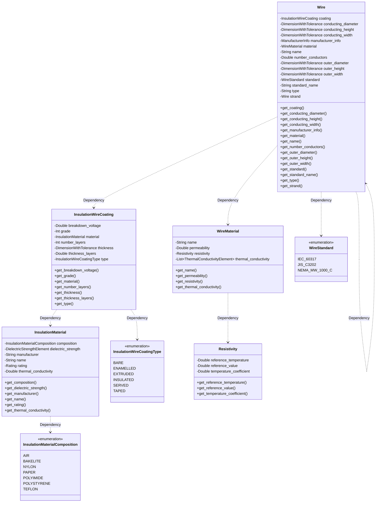

# Wire
As is the philosophy of the whole MAS format, the wire definition and usage tries to resemble reality as much as possible by making its definition independent of the winding where it is used.
This allows the user to have a collection of defined wires that are ready to be used in any magnetic component, or even have the collection from other users or manufacturers.
The wire structure is designed to be able to describe any kind of wire, from Litz wires to planar PCB tracks. It contains some fields that are common for all kinds of wires and some specific ones. The common field are:

* Name: Reference name of the wire.
* Type: Type of the wire. It can be one of the following:
	* Round: Solid round wire, defined by its conducting diameter.
	* Rectangular: Rectangular solid wire, defined by its conducting height and width. This wire can represent from strip wire to PCB tracks.
	* Foil: Solid foil wire, defined by its conducting height and width (or thickness). 
	* Litz: Stranded wire made of other kinds of wires.
* Standard (optional): Standard where the wire is defined (e.g.: IEC 60317 or NEMA MW 1000C)
* Manufacturer Info: Dictionary/Map with the information about the manufacturer, including name, status of the material, internal reference, or cost.
* Material: Conductive material of the wire, usually Copper.
* Number Conductors: The number of conductors in the wire. The conductors are isolated from one another in the case of Litz type, and non-isolated for the rest.
* Coating: The coating field covers anything that insulation material that goes around the wire and has the following fields:
	* Type: Type of the coating. Can be
		* Bare
		* Enamelled
		* Insulated
		* Served
		* Taped
		* Extruded
	* Maximum Thickness: The maximum thickness of the insulation around the wire.
	* Material: Name of the material used or a dictionary/map with its properties, like rating, thermal conductivity, or dielectric strength.
	* Grade: The grade of the insulation around the wire.
	* Number Layers: The number of layers of the insulation around the wire.
	* Thickness Layers: The thickness of the layers of the insulation around the wire.
	* Breakdown Voltage: Minimum voltage that causes a portion of an insulator to experience electrical breakdown and become electrically conductive.

Additionally, depending on the type, more fields are needed, and are described in the following subsections.




## Round wire
This type of wire represents the most commonly used one, the solid round wire, with one or several conductors inside, but without insulation between them. 

This wire needs the following extra fields:
* Conducting Diameter: Diameter of the conductive part of the wire.
* Outer Diameter: Total diameter of the wire, including the conductive part and its coating.

Example of solid round wire with grade 1 coating:
```
{
    "type": "round",
    "material": "copper",
    "numberConductors": 1,
    "conductingDiameter": {
        "nominal": 0.000140
    },
    "outerDiameter": {
        "minimum": 0.000151,
        "maximum": 0.000160
    },
    "coating":{
        "type": "enamelled",
        "maximumThickness": 0.00002,
        "grade": 1,
        "breakdownVoltage": 1600
    }
}
```

Example of solid round with Double Insulation:
```
{
    "type": "round",
    "material": "copper",
    "numberConductors": 1,
    "conductingDiameter": {
        "nominal": 0.000287
    },
    "outerDiameter": {
        "maximum": 0.000439
    },
    "coating": {
        "type": "insulated",
        "material": {
            "composition": "teflon",
            "name": "Tefzel ETFE",
            "manufacturer": "Dupont",
            "manufacturerPartNumber": "D29A01TXX-1.5",
            "dielectricStrength":[
                {
                    "value": 1800,
                    "thickness": 0.003175
                }
            ],
            "rating": {
                "temperature": 180,
                "voltage": 600
            }
        },
        "numberLayers": 2,
        "thicknessLayers": 3.81e-5,
        "breakdownVoltage": 4500
    }
}
```

## Rectangular wire
This type of wire represents any wire with rectangular or square cross sectional shape, with the only exception of the foil wires. This includes strip wires, square wires, and the PCB tracks of the planar magnetics.

This kind of wire needs the following extra fields:
* Conducting Width: Dimension of the conductive part of the wire in the horizontal direction (x-axis or A dimension of the core).
* Conducting Height: Dimension of the conductive part of the wire in the vertical direction (x-axis or B dimension of the core).
* Outer Width: Total width of the wire, including the conductive part and its coating.
* Outer Height: Total height of the wire, including the conductive part and its coating.

Example of solid rectangular wire:
```
{
    "type": "rectangular",
    "material": "copper",
    "numberConductors": 1,
    "conductingWidth": {
        "minimum": 0.00393,
        "nominal": 0.004,
        "maximum": 0.00407
    },
    "conductingHeight": {
        "minimum": 0.00135,
        "nominal": 0.0014,
        "maximum": 0.00145
    },
    "outerWidth": {
        "nominal": 0.00405
    },
    "outerThickness": {
        "minimum": 0.00138,
        "maximum": 0.00161
    },
    "coating":{
        "type": "enamelled",
        "maximumThickness": 0.00016,
        "grade": 1,
        "breakdownVoltage": 1600
    }
}
```

Foil wire
This type of wire represents a kind of rectangular wire that is really thin in one of its dimensions, typically smaller than 0.1 mm. It usually comes without coating, as the wire is cut from large sheets of copper.
This wire needs the following extra fields:
* Conducting Width: Dimension of the conductive part of the wire in the horizontal direction (x-axis or A dimension of the core).
* Conducting Height: Dimension of the conductive part of the wire in the vertical direction (x-axis or B dimension of the core).
* Outer Width: Total width of the wire, including the conductive part and its coating, if present.
* Outer Height: Total height of the wire, including the conductive part and its coating, if present.

Example of foil wire:
```
{
    "type": "foil",
    "material": "copper",
    "numberConductors": 1,
    "conductingHeight": {
        "minimum": 0.0193,
        "nominal": 0.02,
        "maximum": 0.0207
    },
    "conductingWidth": {
        "nominal": 0.0001
    },
    "outerHeight": {
        "minimum": 0.0193,
        "nominal": 0.02,
        "maximum": 0.0207
    },
    "outerThickness": {
        "nominal": 0.0001
    },
    "coating":{
        "type": "bare"
    }
}
```

## Litz wire
Litz wires are a kind of wires that are made by twisting and bundling together other wires (here called strands), commonly solid round wires with small diameters, although some studies are also creating Litz wires with rectangular or PCB tracks. This twisting allows each individual wire to take every possible position along the center axis of the wire, which guarantees a balanced current in all the strands.

This wire needs the following extra fields:
* Strand: The reference name of the solid wire used in the strands, or the fields describing it.
* Outer Diameter: Total diameter of the wire, including the conductive part and its coating.

Example of Litz wire:
```
{
    "type": "litz",
    "numberConductors": 20,
    "manufacturer": "Elektrisola",
    "strand": {
        "type": "round",
        "material": "copper",
        "numberConductors": 1,
        "conductingDiameter": {
            "nominal": 0.00008
        },
        "outerDiameter": {
            "minimum": 0.000095,
            "maximum": 0.000101
        },
        "coating":{
            "type": "enamelled",
            "maximumThickness": 0.0000105,
            "grade": 2,
            "breakdownVoltage": 850
        }
    },
    "outerDiameter": {
        "minimum": 0.540,
        "maximum": 0.574
    },
    "coating": {
        "type": "served",
        "serving": "single"
    }
}
```